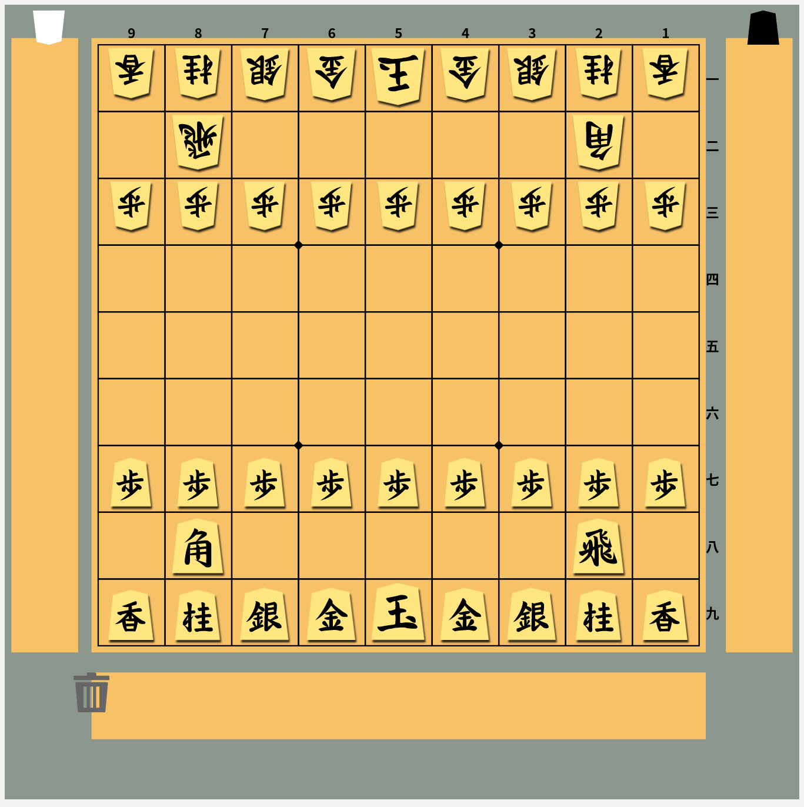

# ただの将棋盤 (Free Shogi Board)

## 概要
普通の(現実世界の)将棋盤と同じ操作ができることを目指して、なるべくシンプルに開発したウェブアプリです。[Vue.js](https://ja.vuejs.org/)と[SVG](https://developer.mozilla.org/ja/docs/Web/SVG)を利用して開発しました。

[GitHub Pages のウェブページ](https://hideboz.github.io/free-shogi-board/) でご試用いただけます。

将棋盤を使用するウェブサービスなどにご利用ください。



## セットアップ方法
セットアップするには、以下のコマンドを実行してください。

```sh
npm install
```

## 開発用サーバの起動方法
開発用サーバを起動して動作を確認するには、以下のコマンドを実行して、表示されるURLにブラウザからアクセスしてください。

```sh
npm run dev
```

## ビルド方法
ビルドするには、以下のコマンドを実行してください。
`/docs`ディレクトリにビルドされます。

```sh
npm run build
```

## 操作方法
動かしたい駒をクリック(タップ)した後、動かしたい先の場所をクリック(タップ)すると、駒を動かすことができます。盤上の駒を、相手の駒があるマスに移動させると、自動的に相手の駒を自分の駒台へ移動した上で、駒が移動します。駒を右クリック(ロングタップ)すると、駒を裏返したり、向きを先後逆にしたりすることができます。将棋盤の右と左にある縦長のスペースが、先手の駒台と後手の駒台です。将棋盤の下にある横長のスペースが使わない駒置き場です。駒落ちの場合などにご利用ください。

## 謝辞
駒画像は [Shogi Images](https://sunfish-shogi.github.io/shogi-images/) のものを使用させていただきました。

## ライセンス (License)
本ソフトウェアはMITライセンスで公開されています。LICENSEを参照してください。
(This software is released under the MIT License, see LICENSE.)